### Build dynamic and beautiful user interfaces like a boss, with Swift.

[](http://doge.mit-license.org) [](https://travis-ci.org/mamaral/Neon/) [](https://img.shields.io/cocoapods/v/Neon.svg) [](https://coveralls.io/r/mamaral/Neon?branch=master) [](https://github.com/Carthage/Carthage)

Neon is built around how user interfaces are naturally and intuitively designed. No more springs and struts. No more whacky visual format language. No more auto layout constraints. We're not robots, so why should we build our UIs like we are?

> ***Neon has been updated to Swift 3.0, but is still currently in beta!***

## Install via CocoaPods 

You can use [Cocoapods](http://cocoapods.org/) to install `Neon` by adding it to your `Podfile`:

```ruby
platform :ios, '8.0'
use_frameworks!
pod 'Neon'
```

##Manual Installation

1. Download and drop `/Source` in your project.  
2. Congratulations!  


To get the full benefits import `Neon` wherever you have a UIView operation:

``` swift
import UIKit
import Neon
```

## Example


Rather than design some arbitrary layout for a demonstration, I figured a good test for the practicality of Neon would be to replicate an existing screen from a major app, one that everyone could recognize. The above screenshot on the left is my profile in the Facebook app, and the screenshot on the right is from the Neon demo project.

Facebook's profile screen was surely built using some form of `UITableView` or `UICollectionView`, but for the sake of simple demonstration I built the top-most major components of the profile in a normal `UIViewController`. After all the customization of the subviews to make them as close to Facebook's design as possible *(I tried my best)*, this is what I came up with for the layout:

```swift
let isLandscape : Bool = UIDevice.currentDevice().orientation.isLandscape.boolValue
let bannerHeight : CGFloat = view.height() * 0.43
let avatarHeightMultipler : CGFloat = isLandscape ? 0.75 : 0.43
let avatarSize = bannerHeight * avatarHeightMultipler

searchBar.fillSuperview()
bannerImageView.anchorAndFillEdge(.Top, xPad: 0, yPad: 0, otherSize: bannerHeight)
bannerMaskView.fillSuperview()
avatarImageView.anchorInCorner(.BottomLeft, xPad: 15, yPad: 15, width: avatarSize, height: avatarSize)
nameLabel.alignAndFillWidth(align: .ToTheRightCentered, relativeTo: avatarImageView, padding: 15, height: 120)
cameraButton.anchorInCorner(.BottomRight, xPad: 10, yPad: 7, width: 28, height: 28)
buttonContainerView.alignAndFillWidth(align: .UnderCentered, relativeTo: bannerImageView, padding: 0, height: 62)
buttonContainerView.groupAndFill(group: .Horizontal, views: [postButton, updateInfoButton, activityLogButton, moreButton], padding: 10)
buttonContainerView2.alignAndFillWidth(align: .UnderCentered, relativeTo: buttonContainerView, padding: 0, height: 128)
buttonContainerView2.groupAndFill(group: .Horizontal, views: [aboutView, photosView, friendsView], padding: 10)
```

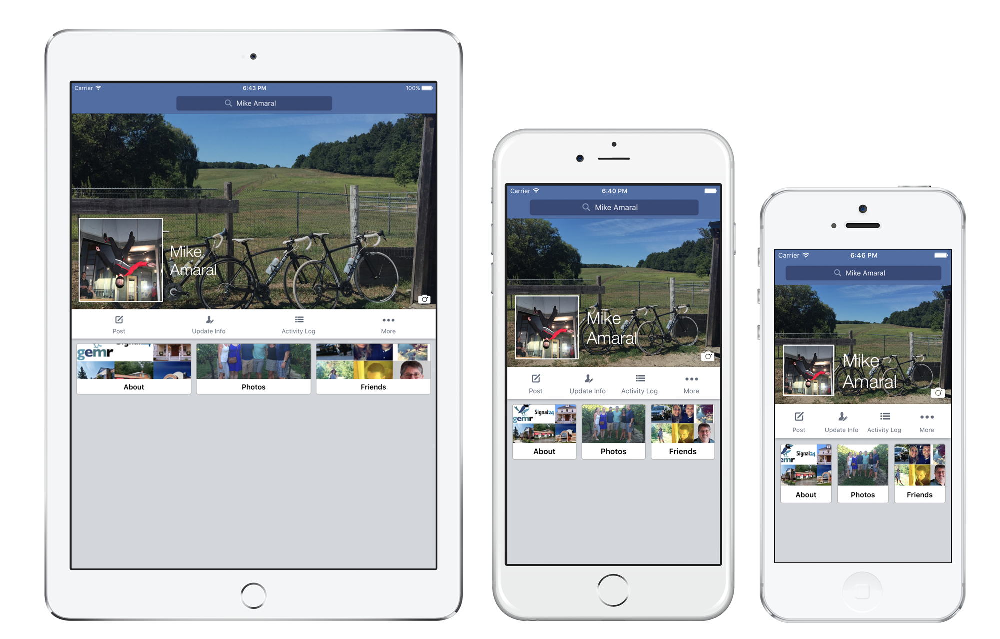

Looks pretty good on every device size! Now, keep in mind you'll probably want constants defined for many of these size/padding values, in order to keep the code cleaner and easier to maintain, but I decided to use real numbers for most of the values to make the code less obscure when new people  are reading through the demonstration. Now, ***unlike Facebook's iPhone app*** the layout built with Neon is ***dynamic***. It is able to handle rotation on all-sized devices with no problem:

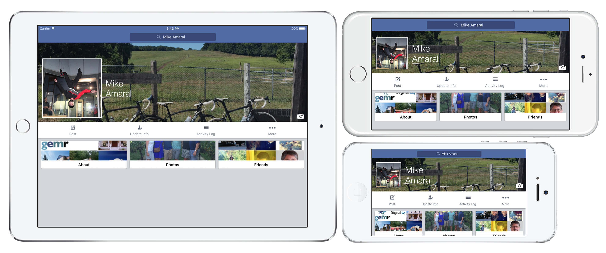

###Not bad for 10 lines of code!


Here's an intentionally convoluted example to show how easy it is to build very complex and dynamic layouts with Neon. The following layout was created with only *20 lines of code*. That's one line of code per view! While impressive, this layout is horrifying and should never be used in an actual app... ever...

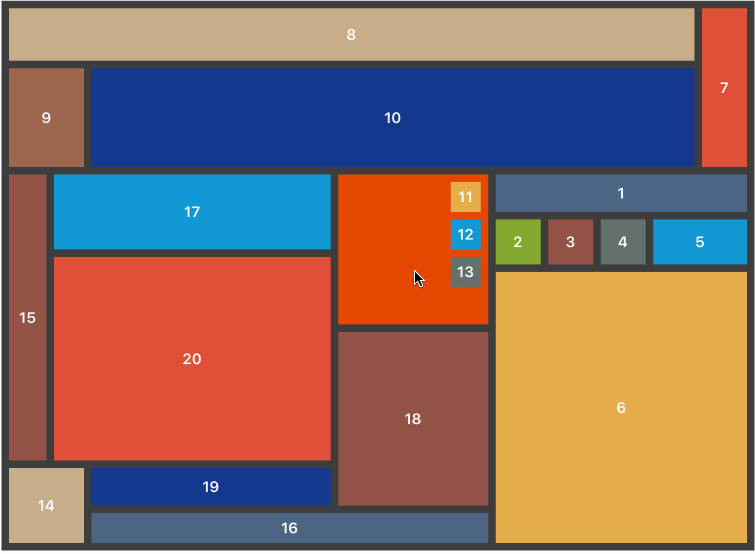


## Anchoring Views

### Center

There are a few ways you can anchor views using Neon, and the first and most simple is anchoring a view in the center of its superview:

```swift
view1.anchorInCenter(width: size, height: size)
```


### Filling Superview

Sometimes you want a view to fill its superview entirely, which couldn't be easier.

```swift
view.fillSuperview()
```

Optionally, if you want a view to fill its superview with padding, you can provide padding instead:

```swift
view1.fillSuperview(left: padding, right: padding, top: padding, bottom: padding)
```


### Corner

The second anchoring method is anchoring a view in its superview's `Corner`. As you might have guessed, the four corners are `.TopLeft`, `.TopRight`, `.BottomLeft`, `.BottomRight`, and coupled with the `anchorInCorner()` function, you can easily anchor a view in any corner like this:

```swift
view1.anchorInCorner(.TopLeft, xPad: padding, yPad: padding, width: size, height: size)
view2.anchorInCorner(.TopRight, xPad: padding, yPad: padding, width: size, height: size)
view3.anchorInCorner(.BottomLeft, xPad: padding, yPad: padding, width: size, height: size)
view4.anchorInCorner(.BottomRight, xPad: padding, yPad: padding, width: size, height: size)
```


### Edge

`Edge` is another pretty obvious one to follow - it specifies on what edge of its superview a view will be anchored to. The four types are `.Top`, `.Left`, `.Bottom`, or `.Right`, and similar to previous examples, you can use the `anchorToEdge()` function to anchor a view to an edge:

```swift
view1.anchorToEdge(.Top, padding: padding, width: size, height: size)
view2.anchorToEdge(.Left, padding: padding, width: size, height: size)
view3.anchorToEdge(.Bottom, padding: padding, width: size, height: size)
view4.anchorToEdge(.Right, padding: padding, width: size, height: size)
```


### Filling an edge

Sometimes, you want to anchor a view against an edge, filling that edge; imagine something like a banner photo for a profile page. Again, this is made as simple as possible using the `anchorAndFillEdge()` function:

```swift
view1.anchorAndFillEdge(.Top, xPad: padding, yPad: padding, otherSize: size)
view2.anchorAndFillEdge(.Bottom, xPad: padding, yPad: padding, otherSize: size)
view3.anchorAndFillEdge(.Left, xPad: padding, yPad: padding, otherSize: size)
view4.anchorAndFillEdge(.Right, xPad: padding, yPad: padding, otherSize: size)
```


> Note that `anchorAndFillEdge()` accepts a parameter called `otherSize`. That parameter is used to set the *other size* that isn't automatically calculated by filling the edge, meaning that if you specify that you want to anchor to and fill the top edge, the width will be automatically calculated, but the height is still unknown, so the value passed in to `otherSize` will be used to set the height. Subsequently, if you want to anchor to and fill the left edge, the height is automatically calculated and `otherSize` will be used to set the width of the view.
> 


## Align

Now that we've anchored primary views, we can start making our UI more complex by aligning other views *relative to other sibling views*, using the (you guessed it) `Align` value. **Sibling views** are views that share the same superview directly. There are twelve `Align` types, and they are all pretty self-explanatory - here's an example using all twelve with the `align()` function:

```
view1.align(.AboveMatchingLeft, relativeTo: anchorView, padding: padding, width: size, height: size)
view2.align(.AboveCentered, relativeTo: anchorView, padding: padding, width: size, height: size)
view3.align(.AboveMatchingRight, relativeTo: anchorView, padding: padding, width: size, height: size)
view4.align(.ToTheRightMatchingTop, relativeTo: anchorView, padding: padding, width: size, height: size)
view5.align(.ToTheRightCentered, relativeTo: anchorView, padding: padding, width: size, height: size)
view6.align(.ToTheRightMatchingBottom, relativeTo: anchorView, padding: padding, width: size, height: size)
view7.align(.UnderMatchingRight, relativeTo: anchorView, padding: padding, width: size, height: size)
view8.align(.UnderCentered, relativeTo: anchorView, padding: padding, width: size, height: size)
view9.align(.UnderMatchingLeft, relativeTo: anchorView, padding: padding, width: size, height: size)
view10.align(.ToTheLeftMatchingBottom, relativeTo: anchorView, padding: padding, width: size, height: size)
view11.align(.ToTheLeftCentered, relativeTo: anchorView, padding: padding, width: size, height: size)
view12.align(.ToTheLeftMatchingTop, relativeTo: anchorView, padding: padding, width: size, height: size)
```

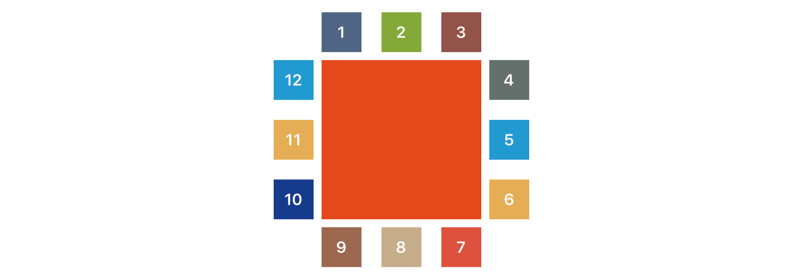


## Align and fill

You don't always know or want to specify the size of a view that you want to layout relative to another, but rather you want to either fill the width, height, or the entire rest of the superview, after aligning with the sibling. Combined with all the different alignment types discussed earlier, we're starting to see how more complex layouts can be built very easily:

```swift
view2.alignAndFillWidth(align: .ToTheRightMatchingTop, relativeTo: view1, padding: padding, height: size / 2.0)
view4.alignAndFillHeight(align: .AboveCentered, relativeTo: view3, padding: padding, width: size / 2.0)
view6.alignAndFill(align: .ToTheLeftMatchingTop, relativeTo: view5, padding: padding)
```

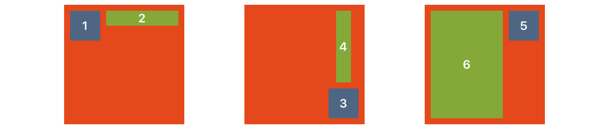


## Align between

Sometimes you want a view to sit between to other views, filling the space between them. Using alignBetweenHorizontal() and alignBetweenVertical(), doing that is super easy! Choose one of your sibling views you want to align your view relative to and pass that in as your `primaryView`. We will use the specified `align` parameter to match that `primaryView` appropriately, and automatically fill either the horizontal or vertical span between the it and the `secondaryView`.

```swift
view1.alignBetweenHorizontal(align: .ToTheRightMatchingTop, primaryView: anchorViewA, secondaryView: anchorViewB, padding: padding, height: size)
view2.alignBetweenVertical(align: .UnderCentered, primaryView: anchorViewB, secondaryView: anchorViewD, padding: padding, width: size)
view3.alignBetweenHorizontal(align: .ToTheLeftMatchingBottom, primaryView: anchorViewD, secondaryView: anchorViewC, padding: padding, height: size)
view4.alignBetweenVertical(align: .AboveMatchingRight, primaryView: anchorViewC, secondaryView: anchorViewA, padding: padding, width: size)
```

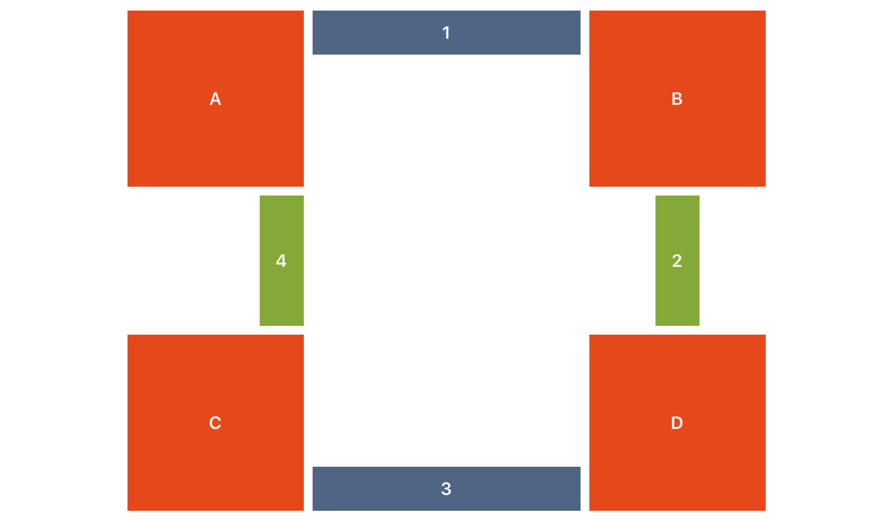

## What about labels?

One of the more complicated parts of working with dynamic layouts, is dealing with labels that may have 1 -> n lines, and as such passing in a specific height isn't always possible without causing a migraine. Neon makes this easy by introducing the `AutoHeight` constant. Pass this value into methods that accept a `height` param, and we will first set the width of the frame, tell the view to `sizeToFit()` so the height is automatically set based on its contents, and then align the view appropriately. For example:

```swift
testLabel.alignBetweenHorizontal(align: .ToTheRightMatchingBottom, primaryView: anchorViewA, secondaryView: anchorViewB, padding: padding, height: AutoHeight)
```


Note that changing the text to something with more characters still produces the same desired result:


> It's important to note that the using `AutoHeight` with something like a `CALayer`, or passing it in to any of the grouping methods (see below) will have undesired consequences, as it almost doesn't *make sense* in this context. Use `AutoHeight` with anything that implements `sizeToFit()` and you should be OK. The vast majority of cases where you'll want to use this is with `UILabel` objects.

## What if I don't want to align them perfectly?

Sometimes you don't want your views to align with their sibling views *exactly* - you may want to align them relative to their siblings, but with a slight offset. You can do this by adding the optional `offset` parameter to any of the above align methods to produce something like the following:

```swift
view1.align(.ToTheRightMatchingTop, relativeTo: anchorViewA, padding: padding, width: size, height: size, offset: offset)
view2.align(.UnderMatchingLeft, relativeTo: anchorViewA, padding: padding, width: size, height: size, offset: offset)
```

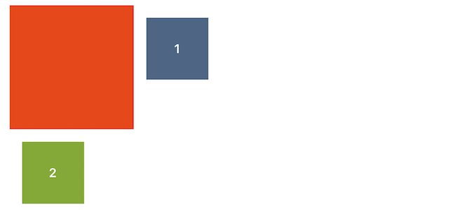

## Grouping

Another common use-case is the *grouping* of sibling views, aligned in a row or column. Using what we've already learned about anchoring views in the center, in a corner, or against an edge, we can also do the same with groups of views!

The primary difference with grouping, is that it is done by the *parent view,* or `superview` of a group of views. For example, let's let two different views center a group of their subviews in each of the two different `Group` configurations, `.Horizontal` and `.Vertical`:

```swift
anchorViewA.groupInCenter(group: .Horizontal, views: [view1, view2, view3], padding: padding, width: size, height: size)
anchorViewB.groupInCenter(group: .Vertical, views: [view4, view5, view6], padding: padding, width: size, height: size)
```

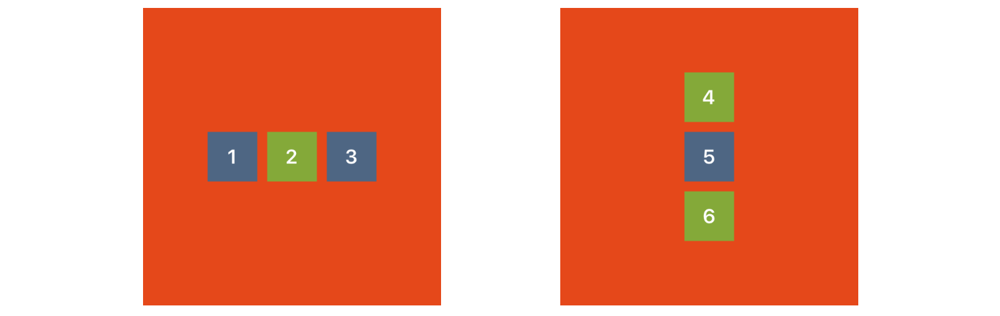

How about grouping views in the corner?

```swift
anchorViewA.groupInCorner(group: .Horizontal, views: [view1, view2, view3], inCorner: .TopLeft, padding: padding, width: size, height: size)
anchorViewB.groupInCorner(group: .Vertical, views: [view4, view5, view6], inCorner: .BottomRight, padding: padding, width: size, height: size)
```

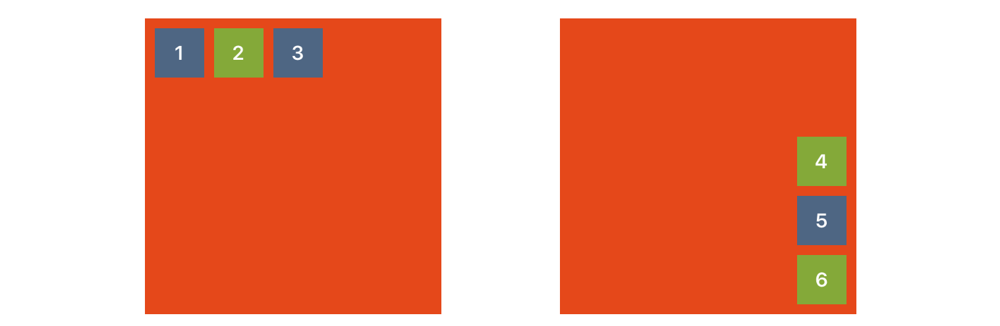

As you might have expected, you can also group either horizontally and vertically against any edge as well:

```swift
anchorViewA.groupAgainstEdge(group: .Horizontal, views: [view1, view2, view3], againstEdge: .Left, padding: padding, width: size, height: size)
anchorViewB.groupAgainstEdge(group: .Vertical, views: [view4, view5, view6], againstEdge: .Bottom, padding: padding, width: size, height: size)
```

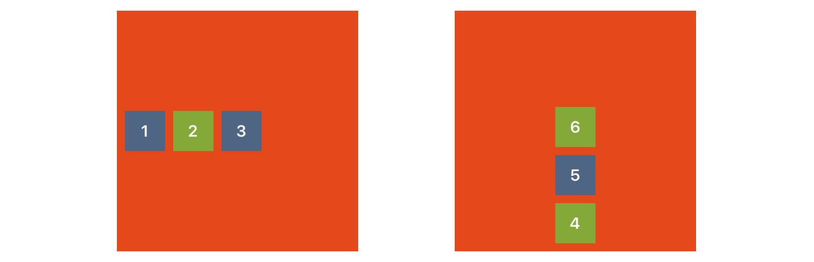

Grouping views relative to a sibling view can be done as well:

```swift
view.groupAndAlign(group: .Horizontal, andAlign: .ToTheRightMatchingTop, views: [view1, view2, view3], relativeTo: anchorViewA, padding: padding, width: size, height: size)
view.groupAndAlign(group: .Vertical, andAlign: .UnderCentered, views: [view4, view5, view6], relativeTo: anchorViewA, padding: padding, width: size, height: size)
```

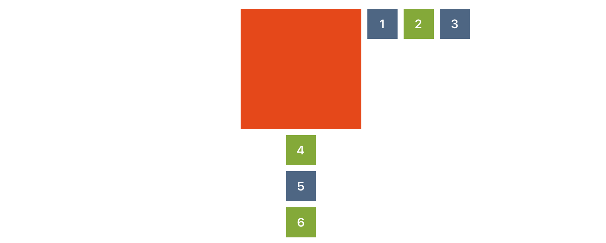

You can also specify that you want a group of subviews to fill their superview, either horizontally or vertically:

```swift
anchorViewA.groupAndFill(group: .Horizontal, views: [view1, view2, view3], padding: padding)
anchorViewB.groupAndFill(group: .Vertical, views: [view4, view5, view6], padding: padding)
```
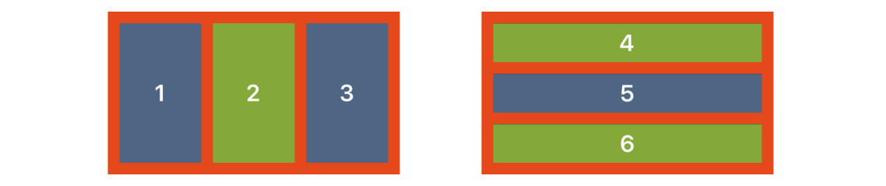

## License

The source is made available under the MIT license. See LICENSE.txt for details.
